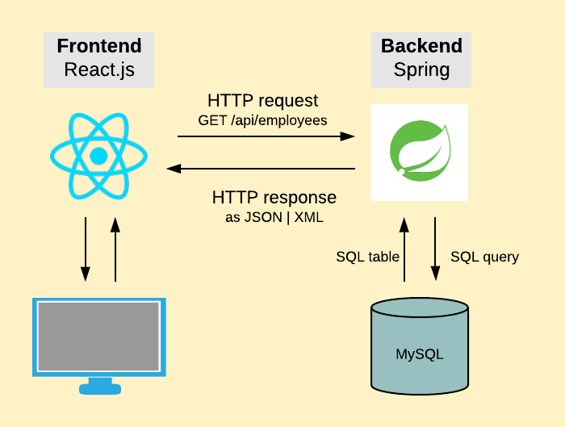

# e-manager



## Εισαγωγή

Η εφαρμογή αυτή στοχεύει στην παροχή μιας εύχρηστης και αποτελεσματικής διεπαφής
με τη βάση δεδομένων του Ιδρύματος τη Βουλής των Ελλήνων για τη σωστή οργάνωση, διαχείριση
και κατανομή των πόρων και των εργαζομένων όλων των διευθύνσεων, υπηρεσιών και τμημάτων του Ιδρύματος.

## Από τη μεριά του Εξυπηρετητή

H server μεριά της εφαρμογής, υλοποιημένη με χρήση του [Spring Framework](https://spring.io/) σε Java,
βρίσκεται στο **e-manager api** repository και
παρέχει ένα σύνολο από end-points για την ανάκτηση και τοποθέτηση δεδομένων στη βάση. Αυτά, περιγράφονται
αναλυτικά στο `API.md` που συνοδεύει το repository.

## Από τη μεριά του Χρήστη

H client μεριά της εφαρμογής, υλοποιημένη με χρήση του [React.js Framework](https://reactjs.org/)
σε Javascript, βρίσκεται στο **e-manager ui** repository και παρέχει τη διεπαφή για το χρήστη
για την αποτελεσματική επικοινωνία με τον Εξυπηρετητή. Λεπτομερείες σχετικά με
τις λειτουργίες που παρέχει και τον τρόπο χρήσης του βρίσκονται στο `README.md`
που συνοδεύει το αντίστοιχο repository.

### Bugs & Περιορισμοί

Όπως κάθε έργο λογισμικού, έτσι και το e-manager application έχει τις "τρύπες" του.
Συγκεκριμένα:

1. Η ταξινόμηση πεδίων αφορά μόνο πρωτογενείς/απλούς τύπους και όχι οντότητες
Για παράδειγμα υπάρχει η δυνατότητα ταξινόμησης των εργαζομένων ως προς Όνομα
ή Επώνυμο αλλά όχι ως προς Διεύθυνση/Τμήμα. Αυτό οφείλεται στο ότι
τα end-points που προσφέρει το Spring Data Rest δεν διαθέτουν αυτή την ιδιότητα.
2. Η Αναζήτηση αλφαριθμητικών πεδίων χωρίς προεπιλογή(π.χ Όνομα Εργαζομένου) δεν υποστηρίζει ελληνικά
λόγω της ιδιοτροπίας του Hibernate(Java API για σύνδεση και διαχείριση βάσεων δεδομένων)
στα Native SQL queries.

### Ελλιπή Χαρακτηριστικά

Δυστυχώς, το e-manager δεν ικανοποιεί ορισμένες λειτουργικές απαιτήσεις που θεωρούνται αυτονόητες
για τέτοιου είδους εφαρμογές.

1. Η εξαγωγή δεδομένων σε μορφή JSON ή XML δεν προσφέρεται κατά την έκδοση 1.0.0
2. Η εφαρμογή, τόσο στο μπροστινό μέρος όσο και στα end-points
που προσφέρει η πίσω μεριά της
δεν χρησιμοποιεί κάποια μορφή ταυτοποίησης και εξουσιοδότησης με βάση κωδικούς και ρόλους χρηστών.
3. Η εφαρμογή δεν υποστηρίζει ταξινόμηση κι αναζήτηση ως προς επιλεγμένε πεδί μόνο, όχι όλα.

## Εκτέλεση

### Λήψη του κώδικα

Αρχικά, για να τρέξουμε την εφαρμογή τοπικά πρέπει να κατεβάσουμε το βασικό αποθετήριο κώδικα,
καθώς και τα επιμέρους αποθετήρια πελάτη-εξυπηρετητή από τα οποία αποτελείται.
Με χρήση του τερματικού αλλάζουμε το τρέχον κατάλογο στην επιθυμητή τοποθεσία
κι εκτελούμε την εντολή

```bash
git clone https://github.com/KostasKoyias/e-manager.git --recurse-submodules
```

### Χρησιμοποιώντας docker

Με το docker, μπορεί κανείς να τρέξει την εφαρμογή σε οποιοδήποτε σύστημα
(αρκεί να έχει πρώτα εγκαταστήσει το docker), εκτελώντας μέσα από τον κατάλογο-ρίζα
της εφαρμογής την εντολή

```bash
docker-compose up
```

και ανοίγωντας με τον επιθυμητό browser στον ακόλουθο σύδνεσμο [http://localhost:9090/](http://localhost:9090/).

### Σε σύστηματα Unix ως Desktop Application

Για να ξεκινήσει κάποιος την εφαρμογή σε περιβάλλον linux αρκεί να προσαρμόσει τις διαδρομές κάτω από
το **e-manager.desktop**. Για παράδειγμα αν το repository βρίσκεται κάτω από το φάκελο
`/home/kostas/Git/Repos/web/e-manager` τότε ένα διπλό click στο εικονίδιο του e-manager αρκεί.
Αλλιώς, πρέπει να προσαρμοστούν οι διαδρομές για τα: Icon και Exec, κάτω από το e-manager.desktop.
Με την εκκίνηση, ένα pop-up terminal θα ζητήσει το absolute path του
frontend(e-manager_ui) και του backend(e-manager_api). Αν όλα πάνε καλά η εφαρμογή θα εκκινήσει
στον default browser αυτόματα. Για τον τερματισμό, πατήστε οποιοδήποτε πλήκτρο στο αντίστοιχο
pop-up terminal.

Να σημειωθεί ότι κατά την έναρξη του backend δημιουργούνται αυτόματα οι
πίνακες στο σχήμα το όνομα του οποίου ορίζεται μες το
application.properties αρχείο του **e-manager api**(<u>Το σχήμα πρέπει να υπάρχει και να είναι κενό</u>).
Αναλυτικές οδηγίες συνοδεύουν το αντίστοιχο repository.
